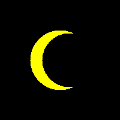

# Chapter 2: Using Objects

### 2.10 SC 4 - [`moon/`](./moon/)

Draw a moon in the night sky.

### IR 2.3.4 - [`target/`](./target/)

Produce this drawing:

### E2.17 & E2.18 - [`scalePicture/`](./scalePicture/)

Using the `Picture` class of Worked Example 2.2, write a `HalfSizePicture` program that loads a picture and shows it at half the original size, centered in the window.

Using the `Picture` class of Worked Example 2.2, write a `DoubleSizePicture` program that loads a picture, doubles its size, and shows the center of the picture in the window.

### P2.1 - [`FourRectanglePrinter.java`](./FourRectanglePrinter.java)

Write a program called `FourRectanglePrinter` that constructs a `Rectangle` object, prints its location by calling `System.out.println(box)`, and then translates and prints it three more times, so that, if the rectangles were drawn, they would form one large rectangle, as shown at right.

Your program will not produce a drawing. It will simply print the locations of the four rectangles.

### P2.8 - [`DayPrinter.java`](./DayPrinter.java)

Using the `Day` class of Worked Example 2.1, write a program that generates a `Day` object representing February 28 of this year, and three more such objects that represent February 28 of the next three years. Advance each object by one day, and print each object. Also print the expected values.

### P2.9 - [`CalendarPrinter.java`](./CalendarPrinter.java)

Your task is to write a program that prints:

-   The date and weekday that is 100 days from today.
-   The weekday of someone's birthday.
-   The date that is 10,000 days from someone's birthday.

### P2.10 - [`LocalDatePrinter.java`](./LocalDatePrinter.java)

Your task is to write a program that prints:

-   The weekday of "Pi day", that is, March 14, of the current year.
-   The date and weekday of "Programmer's day" in the current year; that is, the 256th day of the year. (The number 256, or 28, is useful for some programming tasks.)
-   The date and weekday of the date that is 10,000 days earlier than today.

### P2.11 & P2.12 - [`lineDistance/`](./lineDistance/)

Write a program `LineDistanceTester` that constructs a line joining the points (100, 100) and (200, 200), then constructs points (100, 200), (150, 150), and (250, 50). Print the distance from the line to each of the three points, using the `ptSegDist` method of the `Line2D` class. Also print the expected values. (Draw a sketch on graph paper to find what values you expect.)

Repeat P2.11, but now write a graphical application that shows the line and the points. Draw each point as a tiny circle. Use the `drawString` method to draw each distance next to the point.

### P2.15 - [`trafficLight/`](./trafficLight/)

Write a graphical program that draws a traffic light.

## Extras

### [`StringExtra.java`](./StringExtra.java)

A program that tests the `reverse` method from a string provided by StdIn.

### [`house/`](./house/)

A program that displays two houses.

### [`face/`](./face/)

Draws a face.
