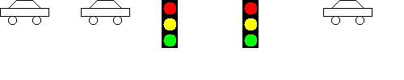

# Chapter 3: Implementing Classes

### Section 3.5 - [`cash_register/`](./cash_register/)

**Problem Solving: Tracing Objects**

The `CashRegister` class totals up sales and computes change due. 

### IR 3.3 (all) - [`suburban_scene/`](./suburban_scene/)

Complete the `TrafficLight` class to draw a traffic light. Modify the `TrafficLight` class so that the width of the rectangle can be specified in the constructor. The gap between the circles should be 20 percent of the width.

Using the `Car` class from the textbook and your `TrafficLight` class, draw the following scene:

### E3.1 - [`Counter.java`](./Counter.java) ([`undo()`](./Counter.java#42))

Add a button to the tally counter in Section 3.1 that allows an operator to undo an accidental button click. As an added precaution, make sure that clicking the undo button more often than the click button has no effect.

### E3.2 - [`Counter.java`](./Counter.java) ([`setLimit()`](./Counter.java#24))

Simulate a tally counter that can be used to admit a limited number of people. If the click button is clicked more often than the limit, it has no effect.

### P3.3 - [`Balloon.java`](./Balloon.java)

Implement a class `Balloon` with a radius. A balloon starts with radius 0.

### P3.4 - [`Sheet.java`](./Sheet.java)

Most countries (with the exception of Canada, Colombia, the Dominican Republic, Mexico, and the United States) follow the ISO 216 standard for paper sizes. An A0 sheet has dimensions 841 × 1189 millimeters. An A1 sheet is obtained by cutting an A0 sheet in half along the larger dimension, yielding a 594 × 841 sheet. An A2 sheet is obtained by cutting it in half again, yielding a 420 × 594 sheet, and so on. Implement a class `Sheet` whose constructor makes an A0 sheet.

### P3.5 - [`Microwave.java`](./Microwave.java)

A microwave control panel has four buttons: one for increasing the time by 30 seconds, one for switching between power levels 1 and 2, a reset button, and a start button. Implement a class that simulates the microwave, with a method for each button. The method for the start button should print a message "Cooking for ... seconds at level ...".
