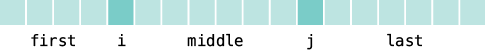

# Chapter 6: Loops

## Practice Exercises

### E6.1: [`Sums.java`](./Sums.java)

Write programs with loops that compute

-   The sum of all even numbers between 2 and 100 (inclusive).

-   The sum of all squares between 1 and 100 (inclusive).

-   All powers of 2 from $2^0$ up to $2^{20}$.

-   The sum of all odd numbers between a and b (inclusive), where a and b are inputs.

-   The sum of all odd digits of an input. (For example, if the input is 32677, the sum would be 3 + 7 + 7 = 17.)

### E6.2: [`Sequence.java`](./Sequence.java)

Write programs that read a sequence of integer inputs and print

-   The smallest and largest of the inputs.

-   The number of even and odd inputs.

-   Cumulative totals. For example, if the input is `1 7 2 9`, the program should print `1 8 10 19`.

-   All adjacent duplicates. For example, if the input is `1 3 3 4 5 5 6 6 6 2`, the program should print `3 5 6`.

### E6.3: [`StringAnalyzer.java`](./StringAnalyzer.java)

Write programs that read a line of input as a string and print

-   Only the uppercase letters in the string.

-   Every second letter of the string.

-   The string, with all vowels replaced by an underscore.

-   The number of vowels in the string.

-   The positions of all vowels in the string.

### E6.6: [`Minimum.java`](./Minimum.java)

Translate the following pseudocode for finding the minimum value from a set of inputs into a Java program.

```
Set a Boolean variable “first” to true.
If the scanner has more numbers
   Read the next value.
   If first is true
      Set the minimum to the value.
      Set first to false.
   Else if the value is less than the minimum
      Set the minimum to the value.
Print the minimum.
```

### E6.7: [`RandomPermutation.java`](./RandomPermutation.java)

Translate the following pseudocode for randomly permuting the characters in a string into a Java program.

```
Read a word.
Repeat word.length() times
   Pick a random position i in the word, but not the last position.
   Pick a random position j > i in the word.
   Swap the letters at positions j and i.
Print the word.
```

To swap the letters, construct substrings as follows:



Then replace the string with

```java
first + word.charAt(j) + middle + word.charAt(i) + last
```

### E6.8: [`SeparateLine.java`](./SeparateLine.java)

Write a program that reads a word and prints each character of the word on a separate line. For example, if the user provides the input "Harry", the program prints

```
H
a
r
r
y
```

## Programming Projects

### P6.1: [`CCNumber.java`](./CCNumber.java)

Enhance Worked Example 6.1 to check that the credit card number is valid. A valid credit card number will yield a result divisible by 10 when you:

Form the sum of all digits. Add to that sum every second digit, starting with the second digit from the right. Then add the number of digits in the second step that are greater than four. The result should be divisible by 10.

For example, consider the number [**4**](#)0[**1**](#)2 [**8**](#)8[**8**](#)8 [**8**](#)8[**8**](#)8 [**1**](#)8[**8**](#)1. The sum of all digits is 89. The sum of the colored digits is 46. There are five colored digits larger than four, so the result is 140. 140 is divisible by 10 so the card number is valid.

### P6.2: [`Fibonacci.java`](./Fibonacci.java)

The _Fibonacci numbers_ are defined by the sequence

$f_1 = 1$

$f_2 = 1$

$f_n = f_{n–1} + f_{n–2}$

Reformulate that as

```
fold1 = 1;
fold2 = 1;
fnew = fold1 + fold2;
```

After that, discard `fold2`, which is no longer needed, and set `fold2` to `fold1` and `fold1` to `fnew`. Repeat an appropriate number of times.

Implement a program that prompts the user for an integer _n_ and prints the *n*th Fibonacci number, using the above algorithm.

### P6.3: [`FactorPrinter.java`](./FactorPrinter.java)

_Factoring of integers._ Write a program that asks the user for an integer and then prints out all its factors. For example, when the user enters 150, the program should print

```
2
3
5
5
```

Use a class [`FactorGenerator`](./FactorGenerator.java) with a constructor `FactorGenerator(int numberToFactor)` and methods `nextFactor` and `hasMoreFactors`. Supply a class [`FactorPrinter`](./FactorPrinter.java) whose `main` method reads a user input, constructs a [`FactorGenerator`](./FactorGenerator.java) object, and prints the factors.

### P6.4: [`PrimePrinter.java`](./PrimePrinter.java)

_Prime numbers._ Write a program that prompts the user for an integer and then prints out all prime numbers up to that integer. For example, when the user enters 20, the program should print

```
2
3
5
7
11
13
17
19
```

Recall that a number is a prime number if it is not divisible by any number except 1 and itself.

Use a class [`PrimeGenerator`](./PrimeGenerator.java) with methods `nextPrime` and `isPrime`. Supply a class [`PrimePrinter`](./PrimePrinter.java) whose `main` method reads a user input, constructs a [`PrimeGenerator`](./PrimeGenerator.java) object, and prints the primes.
